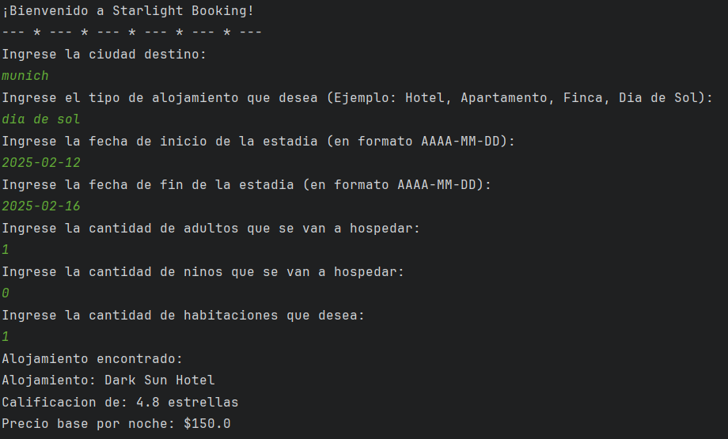

# Trip Travel

This is a console-based backend project built using pure Java, designed for booking accommodations seamlessly and efficiently.

## Table of contents

- [Overview](#overview)
    - [Screenshot](#screenshot)
- [My process](#my-process)
    - [Built with](#built-with)
    - [Useful resources](#useful-resources)
- [Author](#author)

## Overview

### Screenshot

## Process

### Built with

- Git
- Pure functional Java

### Useful resources

- [Fundamentos de Java](https://maycolmo.github.io/pe/java.pdf) - Introdudction to Java
- [Java syntax](https://manualweb.net/java/) - Writing code in Java

## Author

- Website - [Daniela Serrano](https://github.com/danielaser)
